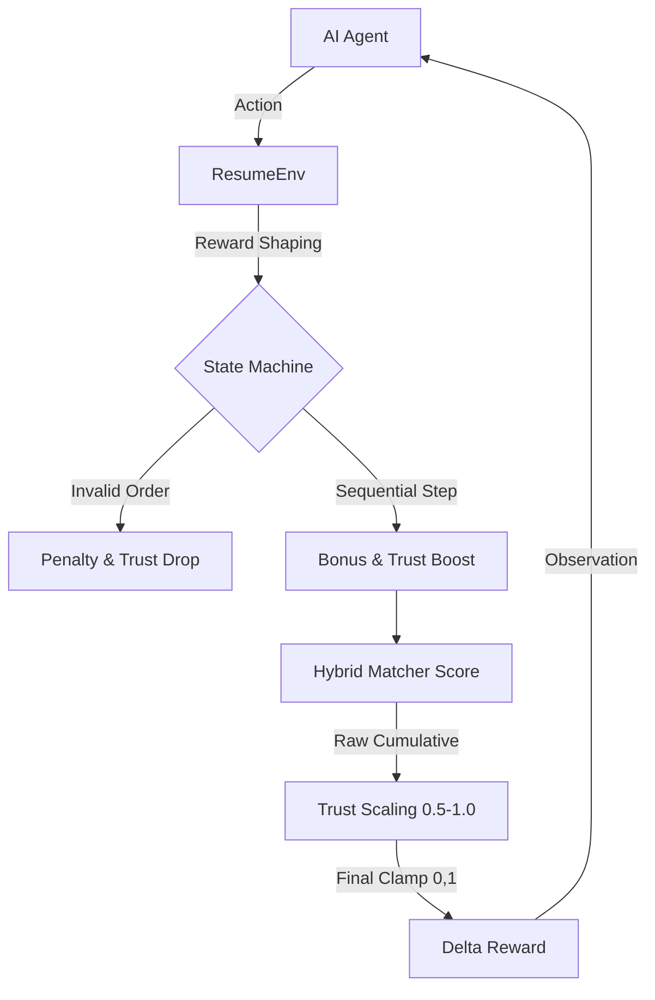

# 🏢 OpenEnv-Compliant Resume-Job Matching Environment

A strictly OpenEnv-compliant real-world simulation environment for Job and Resume Matching, featuring advanced **Trust-Based Scaling**.

## Architecture Overview 🛠️



## Environment Description 🧠
The `resume-matching-env` simulates the high-stakes reasoning chain of an HR AI assistant. Unlike standard one-shot vector search, this environment enforces a **Stateful Reasoning workflow** to evaluate if agents can maintain consistency across multiple logical turns.

## 🔁 Multi-Step Reasoning Workflow
Agents must navigate the following transitions. Skipping steps or taking erratic actions triggers **Behavioral Penalties**:

1.  **Analyze (`analyze_job`)**: Review the job requirements and constraints.
2.  **Shortlist (`shortlist`)**: Filter the candidate pool into a semantic subset.
3.  **Rank (`rank`)**: Order the shortlist by deep contextual relevance.
4.  **Finalize (`finalize`)**: Commit final matches or rankings.

## 🎯 Advanced Reward Engineering (Trust Score)
The system uses an **Advanced Trust-Based Reward Model**:
- **Trust Multiplier**: Calculated between `0.5` and `1.0`.
- **Scaling Phase**: `Final Reward = Cumulative Raw * Trust Score`.
- **Behavioral Update**: Trust increases on consecutive logical steps and decreases on invalid transitions or skipping.
- **Normalization**: All final rewards are strictly clamped to the `[0.0, 1.0]` range for OpenEnv compliance.

## Action & Observation Spaces

### Observation Space
The observation space is a Pydantic model (`Observation`) containing:
- `resumes`: Full candidate vector database.
- `jobs`: Target job definitions.
- `shortlisted_resumes`: State of the current shortlist.
- `trust_score`: Real-time decision quality multiplier.
- `current_step_name`: The logical step expected by the environment.

### Action Space
The action space is a Pydantic model (`Action`) containing:
- `action_type`: `analyze_job`, `shortlist`, `rank`, or `finalize`.
- `matches`: `{job_id: resume_id}` dictionary for batch assignments.
- `ranked_list`: Ordered list of `resume_id`s for ranking tasks.

## 📊 Benchmark Metrics
This environment delivers three difficulty levels to stress-test LLM reasoning:
- **Easy**: 1 Job vs N Resumes (Basic selection).
- **Medium**: 1 Job → Top 3 Ranked List (Semantic ordering).
- **Hard**: 5 Jobs Batch Allocation (Optimization and conflict resolution).

## 🚀 How to Run the Project

The project supports three different execution modes depending on your evaluation needs:

### 1. The Visual Showcase (Interactive Dashboard)
Best for live presentations. Visualizes trust scores, reward trajectories, and semantic radar charts.
```bash
# Start the FastAPI/Uvicorn dashboard
python app.py
```
👉 Open **`http://localhost:7860`** in your browser.

### 2. The Golden Path (Deterministic Baseline)
Ideal for validating environment logic without requiring external LLM credits.
```bash
python baseline_agent.py
```

### 3. AI Agent Evaluation (Inference)
The primary benchmarking tool for LLMs. Features a hybrid search pre-filter and a robust silent fallback.
```bash
export HF_TOKEN="your_huggingface_token"
python inference.py
```

---

## 📊 Understanding the Simulation Logs

Our environment uses the **OpenEnv standardized logging protocol**. Here is how to interpret the results:

### 1. `[START]` Block
Initializes the task metadata, difficulty level, and the model (e.g., `gpt-4o-mini`) assigned to the session.

### 2. `[STEP]` Block
Represents a specific reasoning transition. Example:
`[STEP] step=1 action={'j1': 'r15'} reward=0.40 trust=1.00 xai={...} error=null`
- **Reward**: The incremental (delta) reward added by this action.
- **Trust**: Decision quality multiplier. Dropping below 1.0 indicates skipping steps or erratic behavior.
- **XAI**: JSON metadata explaining exactly which skills matched or were missing from the selection.
- **Error**: Infrastructure errors (like API credit depletion) are captured silently as `null` to ensure evaluation safety.

### 3. `[END]` Block
The final summary of the episode. 
- **Success**: Boolean (`True/False`) based on meeting the reward threshold.
- **Score**: The final trust-scaled, clamped reward (0.0 to 1.0).
- **Rewards**: The full trajectory of delta rewards, showing exactly where the agent added value.

---

## 🔑 Environment Variables & Secrets

To unlock the full potential of the OpenEnv Arena, you need to configure the following environment variables. In Hugging Face Spaces, these should be added under **Settings > Variables and Secrets**.

| Variable | Required | Description |
| :--- | :--- | :--- |
| `HF_TOKEN` | **Yes (for AI)** | Your Hugging Face Access Token. Required for `inference.py` to call the Serverless Inference API. Ensure the token has "Read" (Inference) permissions. |
| `PORT` | No | The port the web dashboard (`app.py`) listens on. Defaults to `7860` (Hugging Face standard). |

### Setting up `HF_TOKEN`
1. Go to [Hugging Face Settings](https://huggingface.co/settings/tokens).
2. Create a new token with **Read** access to the Inference API.
3. **Local**: `export HF_TOKEN="your_token_here"`
4. **Docker**: `docker run -e HF_TOKEN="your_token_here" resume-arena`

---

## 🛠 Project Components
- **`app/env/environment.py`**: The state machine enforcing the Analyze -> Shortlist -> Rank -> Finalize lifecycle.
- **`app/env/reward.py`**: The deterministic 90/10 Hybrid NLP scoring engine.
- **`inference.py`**: Highly robust agent interface with OpenAI/HF router integration and silent fallback logic.
- **`app.py`**: Glassmorphism UI (FastAPI) for real-time dashboarding.

## ✅ OpenEnv Compliance Checklist
- [x] **Stateful API**: Implements `reset()` and `step()` with Pydantic serialization.
- [x] **Trust-Based Scaling**: Behavioral reward shaping based on decision consistency.
- [x] **Deterministic Ground Truth**: Uses hybrid vectors to eliminate scoring bias.
- [x] **Structured Logging**: Standardized benchmark output for automated ranking.
- [x] **Container Ready**: Includes `Dockerfile` for single-command deployment.
